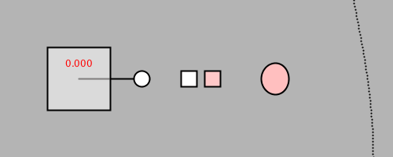

# LoopTemplates
Templates for generating animated seamless loops in Processing, p5.js, and Processing.py

* [Processing (Java) version](https://github.com/golanlevin/LoopTemplates/blob/master/animgif_processing/animgif_processing.pde)
* [p5.js (JavaScript) version](https://github.com/golanlevin/LoopTemplates/blob/master/animgif_p5js/sketch.js), [alpha p5.js web editor version](https://alpha.editor.p5js.org/natureofcode/sketches/SkOZ9LDIf)
* [Processing.py (Python) version](https://github.com/golanlevin/LoopTemplates/blob/master/animgif_processingpy/animgif_processingpy.pyde)
